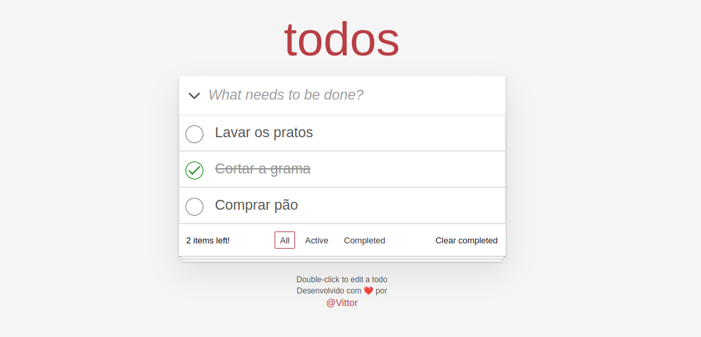
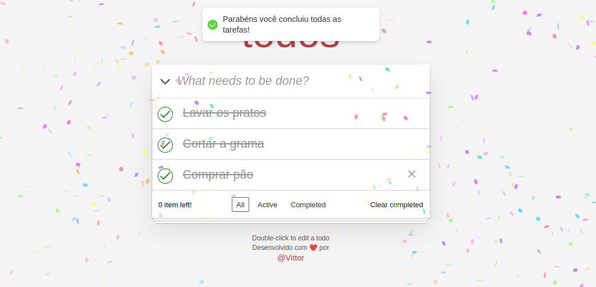
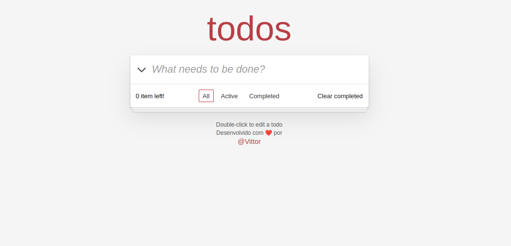
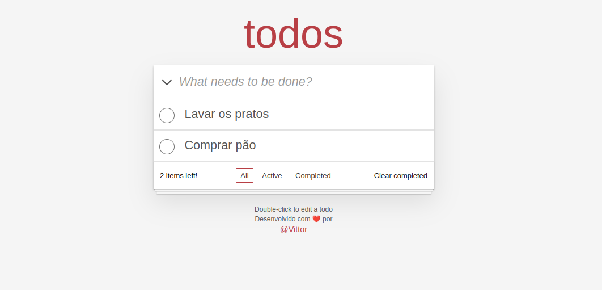
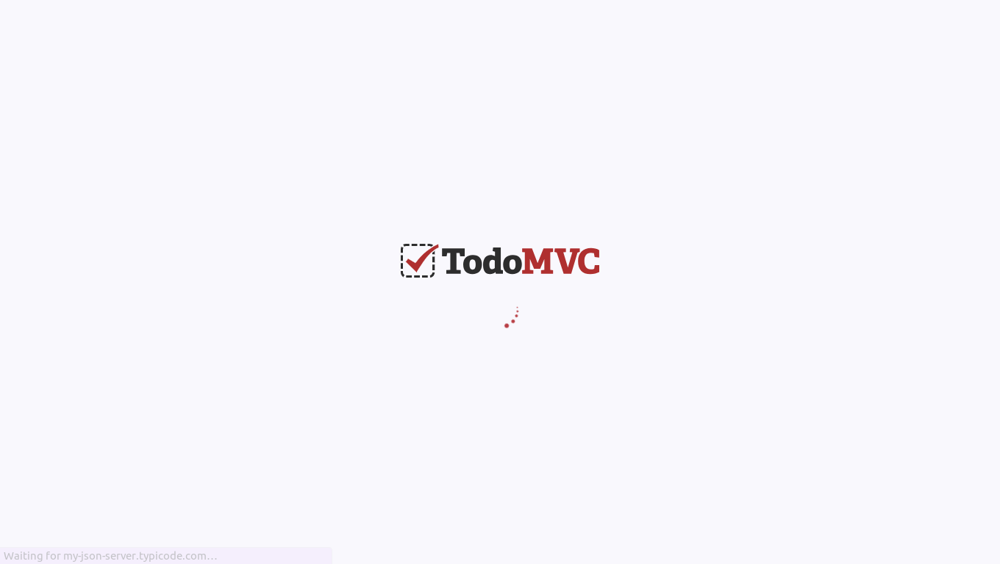
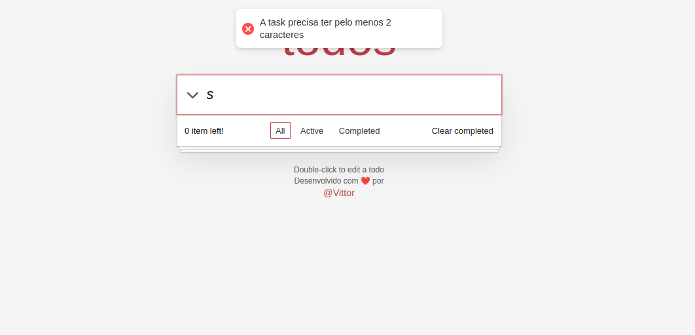

# Desafio Front-end na enContact

Bem-vindo ao meu teste para desenvolvimento front-end na enContact.

## Sobre o Projeto

Este projeto é uma implementação da lista de tarefas inspirada no Todo MVC. Foi desenvolvido como parte do teste para a posição de desenvolvedor front-end na enContact. O objetivo principal é demonstrar minhas habilidades em TypeScript, CSS, gerenciamento de estado e integração com API.

## Imagens

|               Listagem de Todos               |                  Tarefas concluidas                  |        Todas as tarefas apagadas        |                 Limpa as que estão completas                 | Tela de carregamento                                | validando a criação de tarefa                   |
| :-------------------------------------------: | :--------------------------------------------------: | :-------------------------------------: | :----------------------------------------------------------: | --------------------------------------------------- | ----------------------------------------------- |
|  |  |  |  |  |  |

## Como Iniciar

Siga as instruções abaixo para começar:

1. Faça o fork deste repositório no Github.
2. Clone o projeto para o seu ambiente local:
   ```
   git clone https://github.com/Vittor-Emanoel/DesafioReactFrontendJunior2024.git
   ```
3. Navegue até o diretório do projeto:
   ```
   cd DesafioReactFrontendJunior2024
   ```
4. Instale as dependências do projeto utilizando o Yarn:

   ```
   yarn install
   ```

   Certifique-se de que você está utilizando o Node.js na versão 16.16x. Caso precise de uma versão específica do Node.js, recomendo o uso de gerenciadores de versão como o NVM (Node Version Manager).

5. Inicie o servidor de desenvolvimento:
   ```
   yarn start
   ```
6. Abra [http://localhost:3000](http://localhost:3000) no seu navegador para visualizar o aplicativo.

## Features

- [x] Recuperação das tarefas iniciais via GET da [API](https://my-json-server.typicode.com/EnkiGroup/DesafioReactFrontendJunior2024/todos)
- [x] Adição de novas tarefas
- [x] Listagem das tarefas
- [x] Marcação e desmarcação de tarefas como concluídas
- [x] Contagem de itens restantes
- [x] Limpeza de tarefas concluídas
- [x] Filtragem de tarefas por "Todos", "Ativos" e "Completos"

## Tecnologias & Padrões

- [x] [ReactJs]
- [x] [Typescrit]
- [x] [Axios]
- [x] [Styled-components]
- [x] [Conventional-commits]
- [x] [React Testing library & Jest]

### Testes Unitários e de Integração

- Os testes são organizados usando a biblioteca Jest e React Testing Library.
- Para executar os testes, utilize o comando `yarn test`.

### Decisões de Design e Implementação

- Optei por utilizar o Styled-components pelo desafio de replicar a ui do TodoMVC sem nenhum atalho css que o Tailwind trás. As vezes nos apegamos as libs e nos esquemos das bases.

## Autor

Vittor Emanoel, 21 anos - [Meu GitHub](https://github.com/Vittor-Emanoel)
[Meu Linkedin](https://www.linkedin.com/in/vittor-emanoel-8971321b1/)

"O sucesso é o encontro do preparo com a oportunidade" - Autor desconhecido

Desenvolvido com muito esforço e empenho!
